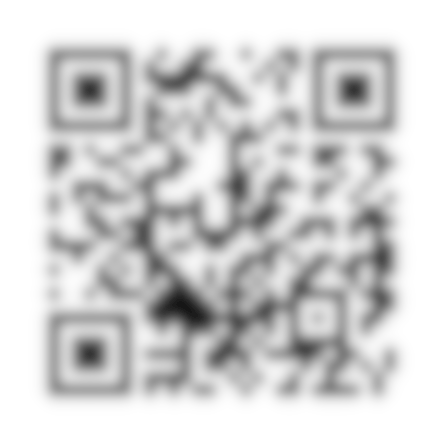
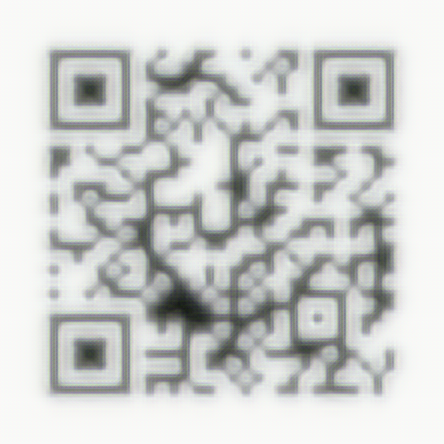

Challenge
```
Everything close up is blurry... can you please help me read this? 
```
It gave me image in which there was a blurred QR CODE



I don't know much about photo editing tools such as photoshop or gimp which would have made this task more easier. I googled De blurring images and got a site 
```https://imageupscaler.com/deblurring/``` This site sharpened the image to an extent. 



Then just zoom out from the image and scan the image to get the flag. I don't know if it was the intended solution to this challenge

flag:
```
flag{3efd4bd34663e618c70e051505c83f9f}
```
